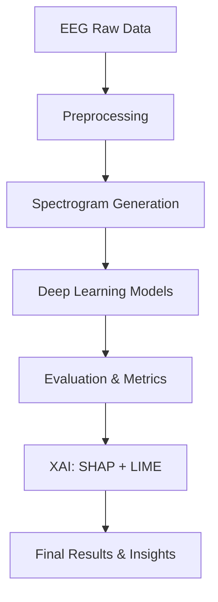

# 🧠 EEG Spectrogram Classification with Deep Learning

This repository contains my project on **EEG spectrogram classification**, where I compare multiple deep learning architectures for detecting harmful brain activity. The study also integrates **metadata features** and applies **explainable AI (XAI)** techniques like **SHAP** and **LIME** for interpretability.

---

## 📌 Project Overview

Electroencephalography (EEG) spectrograms provide a time–frequency representation of brain activity. In this project, I:

- Preprocessed EEG spectrograms and metadata
- Trained deep learning models (**VGG16, Vision Transformer (ViT), EfficientNet, RetNet**)
- Combined **image data + metadata** for improved performance
- Evaluated models on classification accuracy
- Applied **SHAP and LIME** for model interpretability
- Achieved **~96–97% accuracy** on the test dataset

---

## 🗂️ Dataset

- **Source:** [HMS Harmful Brain Activity Classification](https://www.kaggle.com/competitions/hms-harmful-brain-activity-classification)
- **Size:** ~17,000 spectrogram images + metadata (patient info, EEG features)
- **Classes:**
  - Seizure
  - LPDA
  - LPD
  - Normal
  - GPD
  - GPDA

---

## ⚙️ Methodology

### 1. Preprocessing

- Converted EEG signals into spectrograms
- Normalized and augmented data
- Encoded metadata features

### 2. Model Architectures

- **VGG16** (CNN-based baseline)
- **Vision Transformer (ViT)**
- **EfficientNet**
- **RetNet** (modern sequence model)

### 3. Explainable AI

- **SHAP** → Feature attribution for metadata
- **LIME** → Visual explanations on EEG spectrograms

---

## 📊 Results

- **RetNet + Metadata fusion** gave the best accuracy (~97%).
- **VGG16** worked efficiently on spectrograms with competitive results.
- **Explainability** confirmed alignment with biomedical insights.

| Model        | Accuracy |
| ------------ | -------- |
| VGG16        | ~94%     |
| ViT          | ~92%     |
| EfficientNet | ~95%     |
| RetNet       | ~97%     |

---

## 📌 Project Flow

